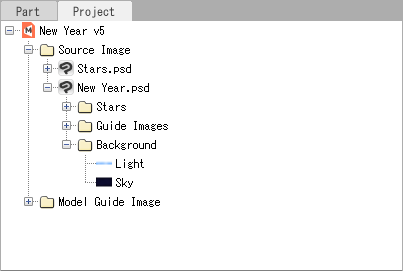
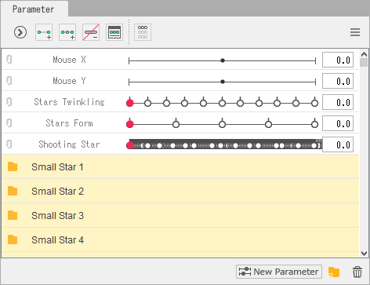
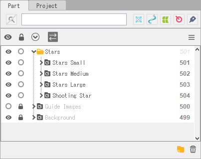

# Python Scripting

> This documentation is pretty bad and I know it too. >_>
> Help make it better by giving feedback via **Issues** or directly contribute by creating a **Pull Request**. ^^

The Python extension adds a new menu to Cubism, which enables executing Python scripts from inside Cubism that interact with the program.
The scripts are read from the `scripts` directory under the Cubism data folder.
You can open this folder by selecting the menu option `Open Scripts folder`.
The menu option `Reload Scripts` has to be used when new scripts have been added or the name of the script has been changed to re-build the menu.
It is not required to be used when changing the script's code as it only re-indexes the scripts's metadata and file names, but not the content.

## Implementation Status

The following things have been implemented but are barely tested:

- Cubism Model files
  - Art Meshes
  - Parts (Folders)
  - Glue
  - Warp Deformers
  - Rotation Deformers

The following things have not been implemented yet:

- Cubism Animation files

## How to access data?

### The Project

All currently opened model and animation files (called documents) are summarized in a project.
The current project can be accessed via the **project** variable and all documents are summarized in the **documents** member variable.
To only list model or animation documents the list can be filtered via the **onlyDocuments()** or **onlyAnimations()** method.

```python
#!/bin/env python2.7

# Enumerating documents (shorthand for project.documents)
for document in project:
    print(document)

# Accessing the document list directly
for document in project.documents:
    if isinstance(document, ModelDocument):
        print('Model: %s' % document)
    elif isinstance(document, AnimationDocument):
        print('Animation: %s' % document)

# Using filters to only get a specific kind of documents
for document in project.documents.everything:
    print(document)
for document in project.documents.onlyModels:
    print(document)
for document in project.documents.onlyAnimations:
    print(document)

# The document that is currently shown in Cubism
print(project.documents.current)

# Creating documents (completely untested)
myModel = project.createModel('My Model')
myAnimation = project.createAnimation('My Animation')

project += myModel
project += myAnimation
project.documents += myModel
project.documents += myAnimation
```

class `Project`:

- property `name: str`: The name of the project
- property `documents: DocumentList`: All documents in the project
- method `createModel(name): ModelDocument`: Creates a new model
- method `createAnimation(name): AnimationDocument`: Creates a new animation

class `DocumentList`:

- property `everything: DocumentList`: Removes all filters from the list
- property `onlyModels: DocumentList`: Filters the list by models
- property `onlyAnimations: DocumentList`: Filters the list by animations
- operator `[]` (getitem) with `int`: Returns the n-th document
- operator `[]` (getitem) with `AnimationDocumentGuid`: Returns the animation document with the GUID
- operator `[]` (getitem) with `ModelDocumentGuid`: Returns the model document with the GUID
- operator `+=` (iadd): Adds the document to the project
- operator `-=` (isub): Removes the document from the project
- operator `in` (contains): Returns `True` if the document is contained in the project
---

### The Model Document

Model documents are used for rigging and contain the following elements:

- Linked PSD Sources (See Project tab)
- Model Images (See Project tab)
- Parameters (See Parameter tab)
- Physics (See Modeling -> Open Physics)
- Model Elements (See Part tab)

class `ModelDocument`:

- property `name: str`: The name of the model
- property `guid: AnimationDocumentGuid | ModelDocumentGuid`: Returns the GUID of the document
- property `filename: str`: The file path of the model
- property `size: (int, int)`: The model dimensions in as with x height tuple
- property `imageSources: ImageSourceList`: All linked PSD image sources
- property `modelImageGroups: ModelImageGroupList`: All model image groups
- property `parameters: ParameterList`: All parameters
- property `physics: PhysicsList`: All physics
- property `elements: ElementList`: All model elements
- method `createImageSource(name: str, path: str): ImageSource`: Creates new PSD source file from path
- method `createModelImageGroup(name: str): ModelImageGroup`: Creates new model image group
- method `createModelImage(name: str, layer: Layer): ModelImage`: Creates new model image for the provided PSD layer
- method `createParameter(name: str, id: str): Parameter`: Creates a new parameter
- method `createParameterGroup(name: str, id: str): ParameterGroup`: Creates a new parameter group
- method `createPhysics(name: str, id: str): Physics`: Creates a new physics setting
- method `createPart(name: str, id: str): Part`: Creates a new part (folder) element
- method `createArtMesh(name: str, id: str, image: ModelImage): ArtMesh`: Creates a new art mesh element
- method `createWarpDeformer(name: str, id: str, x: float, y: float, width: float, height: float, columns: int, rows: int): WarpDeformer`: Creates a new warp deformer at the specified location with the specified dimensions and number of subdivisions
- method `createRotationDeformer(name: str, id: str, x: float, y: float, angle: float, scale: float): RotationDeformer`: Creates a new rotation deformer at the specified location with the provided angle and scale
- operator `[]` (getitem) with `ImageSourceNamePath`: Returns the image source with the name-based path
- operator `[]` (getitem) with `ImageSourceGuid`: Returns the image source with the GUID
- operator `[]` (getitem) with `ImageSourceGuidPath`: Returns the image source with the GUID-based path
- operator `[]` (getitem) with `ModelImageGroupNamePath`: Returns the model image group with the name-based path
- operator `[]` (getitem) with `ModelImageNamePath`: Returns the model image with the name-based path
- operator `[]` (getitem) with `ModelImageGuidPath`: Returns the model image with the GUID-based path
- operator `[]` (getitem) with `ParameterNamePath`: Returns the parameter with the name-based path
- operator `[]` (getitem) with `ParameterIdPath`: Returns the parameter with the ID-based path
- operator `[]` (getitem) with `ParameterGuid`: Returns the parameter with the GUID
- operator `[]` (getitem) with `ParameterGuidPath`: Returns the parameter with the GUID-based path
- operator `[]` (getitem) with `ParameterChildNamePath`: Returns the parameter or parameter group with the name-based path
- operator `[]` (getitem) with `ParameterChildIdPath`: Returns the parameter or parameter group with the ID-based path
- operator `[]` (getitem) with `ParameterChildGuidPath`: Returns the parameter or parameter group with the GUID-based path
- operator `[]` (getitem) with `ParameterGroupNamePath`: Returns the parameter group with the name-based path
- operator `[]` (getitem) with `ParameterGroupIdPath`: Returns the parameter group with the ID-based path
- operator `[]` (getitem) with `ParameterGroupGuid`: Returns the parameter group with the GUID
- operator `[]` (getitem) with `ParameterGroupGuidPath`: Returns the parameter group with the GUID-based path
- operator `[]` (getitem) with `PhysicsNamePath`: Returns the physics with the name-based path
- operator `[]` (getitem) with `PhysicsGuid`: Returns the physics with the GUID
- operator `[]` (getitem) with `PhysicsGuidPath`: Returns the physics with the GUID-based path
- operator `[]` (getitem) with `PhysicsInputGuid`: Returns the phsyics input with the GUID
- operator `[]` (getitem) with `PhysicsInputGuidPath`: Returns the phsyics input with the GUID-based path
- operator `[]` (getitem) with `PhysicsOutputGuid`: Returns the phsyics output with the GUID
- operator `[]` (getitem) with `PhysicsOutputGuidPath`: Returns the phsyics output with the GUID-based path
- operator `[]` (getitem) with `PhysicsVertexGuid`: Returns the phsyics vertex with the GUID
- operator `[]` (getitem) with `PhysicsVertexGuidPath`: Returns the phsyics vertex with the GUID-based path
- operator `[]` (getitem) with `PartNamePath`: Returns the part (group) with the name-based path
- operator `[]` (getitem) with `PartIdPath`: Returns the part (group) with the ID-based path
- operator `[]` (getitem) with `PartGuid`: Returns the part (group) with the GUID
- operator `[]` (getitem) with `PartGuidPath`: Returns the part (group) with the GUID-based path
- operator `[]` (getitem) with `ChildNamePath`: Returns the element with the name-based path
- operator `[]` (getitem) with `ChildIdPath`: Returns the element with the ID-based path
- operator `[]` (getitem) with `ChildGuidPath`: Returns the element with the GUID-based path
- operator `[]` (getitem) with `ArtMeshNamePath`: Returns the art mesh with the name-based path
- operator `[]` (getitem) with `ArtMeshIdPath`: Returns the art mesh with the ID-based path
- operator `[]` (getitem) with `ArtMeshGuid`: Returns the art mesh with the GUID
- operator `[]` (getitem) with `ArtMeshGuidPath`: Returns the art mesh with the GUID-based path
- operator `[]` (getitem) with `WarpDeformerNamePath`: Returns the warp deformer with the name-based path
- operator `[]` (getitem) with `WarpDeformerIdPath`: Returns the warp deformer with the ID-based path
- operator `[]` (getitem) with `WarpDeformerGuid`: Returns the warp deformer with the GUID
- operator `[]` (getitem) with `WarpDeformerGuidPath`: Returns the warp deformer with the GUID-based path
- operator `[]` (getitem) with `RotationDeformerNamePath`: Returns the rotation deformer with the name-based path
- operator `[]` (getitem) with `RotationDeformerIdPath`: Returns the rotation deformer with the ID-based path
- operator `[]` (getitem) with `RotationDeformerGuid`: Returns the rotation deformer with the GUID
- operator `[]` (getitem) with `RotationDeformerGuidPath`: Returns the rotation deformer with the GUID-based path
- operator `[]` (getitem) with `GlueNamePath`: Returns the glue with the name-based path
- operator `[]` (getitem) with `GlueIdPath`: Returns the glue with the ID-based path
- operator `[]` (getitem) with `GlueGuid`: Returns the glue with the GUID
- operator `[]` (getitem) with `GlueGuidPath`: Returns the glue with the GUID-based path

---

The linked PSD sources from the Project tab can be accessed via the model document's **imageSources** member variable.
Each image source represents a single PSD file which can hold nested folders (image layer groups) and image layers which can be accessed via the **layers** member variable.



For the ease of accessing elements in the model file-like paths can be used.
The use of them will be demonstrated further below.
The following paths exists to access image sources and their layer information:

- ImageSourceName: A linked PSD image file
- LayerName: A layer (no groups) in a linked PSD image file
- LayerChildName: A layer or group in a linked PSD image file
- LayerGroupname: A layer group in a linked PSD image file

```python
#!/bin/env python2.7

myModel = project.documents.onlyModels[0]

def printLayers(layers, prefix=''):
    for layer in layers:
        if isinstance(layer, ImageLayer):
            print('%sImage Layer: %s' % (prefix, layer.name))
        elif isinstance(layer, ImageLayerGroup):
            print('%sImage Layer Group: %s' % (prefix, layer.name))
            printLayers(layer.layers, prefix + '  ')

# Prints a list all PSD image sources and the contained layers
for imageSource in myModel.imageSources:
    print('Image Source: %s at "%s"' \
        % (imageSource.name, imageSource.filename))
    printLayers(imageSource.layers)

# Paths can be used to faster access specific layers of the PSD file
myPsdFile  = myModel[ImageSourceName / 'MyDrawing.psd']
leftEye  = myPsdFile[LayerChildName  / 'Head' / 'Eyes' / 'EyeL']
leftIris = myPsdFile[LayerName       / 'Head' / 'Eyes' / 'EyeL' / 'Iris']
rightEye = myPsdFile[LayerGroupName  / 'Head' / 'Eyes' / 'EyeR']
```

class `ImageSourceList`:

- operator `[]` (getitem) with `int`: Returns the n-th PSD image source
- operator `[]` (getitem) with `str`: Returns the PSD image source with name
- operator `[]` (getitem) with `ImageSourceGuid`: Returns the PSD image source with the GUID
- operator `+=` (iadd): Adds the PSD image source to the model
- operator `-=` (isub): Removes the PSD image source from the model
- operator `in` (contains): Returns `True` if the PSD image source is contained in the model

class `ImageSource`:

- property `name: str`: The name of the PSD image file
- property `filename: str`: The file name of the PSD image file
- property `size: (int, int)`: The PSD image dimensions (width x height)
- property `memo: str`: Additional text information about the PSD image source
- property `description: str`: Additional description for the PSD image source
- property `layers: LayerList`: All layers of this PSD image file
- operator `[]` (getitem) with `int`: Returns the n-th PSD image layer or group
- operator `[]` (getitem) with `str`: Returns the PSD image layer or group with name
- operator `[]` (getitem) with `ImageLayerGuid`: Returns the PSD image layer with the GUID
- operator `[]` (getitem) with `ImageLayerGroupGuid`: Returns the PSD image layer group with the GUID
- operator `+=` (iadd): Adds the PSD image layer or group to the image source
- operator `-=` (isub): Removes the PSD image layer or group from the image source
- operator `in` (contains): Returns `True` if the PSD image layer or group is contained in the image source

class `LayerList`:

- property `everything: LayerList`: Removes all filters from the list
- property `onlyLayers: LayerList`: Filters the list by layers (no groups)
- property `onlyGroups: LayerList`: Filters the list by groups (no layers)
- operator `[]` (getitem) with `int`: Returns the n-th PSD image layer or group
- operator `[]` (getitem) with `str`: Returns the PSD image layer or group with name
- operator `[]` (getitem) with `ImageLayerGuid`: Returns the PSD image layer with the GUID
- operator `[]` (getitem) with `ImageLayerGroupGuid`: Returns the PSD image layer group with the GUID
- operator `+=` (iadd): Adds the PSD image layer or group to the image source
- operator `-=` (isub): Removes the PSD image layer or group from the image source
- operator `in` (contains): Returns `True` if the PSD image layer or group is contained in the image source

class `Layer`:

- property `name: str`: The layer name
- property `guid: LayerGuid`: The layer GUID
- property `filename: str`: The PSD image source file name of this layer

class `LayerGroup`:

- property `name: str`: The layer group name
- property `guid: LayerGroupGuid`: The layer group GUID
- property `filename: str`: The PSD image source file name of this layer group
- property `layers: LayerList`: The layers contained by this layer group
- operator `[]` (getitem) with `int`: Returns the n-th PSD image layer or group
- operator `[]` (getitem) with `str`: Returns the PSD image layer or group with name
- operator `[]` (getitem) with `ImageLayerGuid`: Returns the PSD image layer with the GUID
- operator `[]` (getitem) with `ImageLayerGroupGuid`: Returns the PSD image layer group with the GUID
- operator `+=` (iadd): Adds the PSD image layer or group to the layer group
- operator `-=` (isub): Removes the PSD image layer or group from the layer group
- operator `in` (contains): Returns `True` if the PSD image layer or group is contained in the layer group

---

The PSD image sources are referenced by model images.
Model images are used by art meshes and define the image / layer that is displayed.
A single model image can have many linked PSD layers.
However, only one can be active at the same time.
Model images are summarized in model groups that can be accessed via the **modelImageGroups** member variable of the document.

The following paths exist for accessing model images:

- ModelImageGroupName: A model image group
- ModelImageName: A model image

```python
#!/bin/env python2.7

myModel = project.documents.onlyModels[0]

# Print all model images
for imageGroup in document.modelImageGroups:
    print('Model Image Group: %s' % imageGroup.name)
    for modelImage in imageGroup.modelImages:
        print('  Model Image: %s' % modelImage.name)
        activeLayer = modelImage.activeLinkedLayer
        for imageLayer in modelImage.linkedLayers:
            active = ' (active)' if imageLayer == activeLayer else ''
            print('    Image Layer: %s at "%s"%s' \
                % (imageLayer.name, imageLayer.filename, active))

# Paths can be used to faster access specific model images
myGroup     = document[ModelImageGroupName / 'My Group']
headOutline = document[ModelImageName      / 'My Group' / 'HeadOutline']
eyeL        = document[ModelImageName      / 'My Group' / 'EyeL']
```

class `ModelImageGroupList`:

- operator `[]` (getitem) with `int`: Returns the n-th model image group
- operator `[]` (getitem) with `str`: Returns the model image group with name
- operator `[]` (getitem) with `ModelImageGroupNamePath`: Returns the model image group with the name-based path
- operator `[]` (getitem) with `ModelImageNamePath`: Returns the model image with the name-based path
- operator `+=` (iadd): Adds the model image group to the model
- operator `-=` (isub): Removes the model image group from the model
- operator `in` (contains): Returns `True` if the model image group is contained in the model

class `ModelImageGroup`:

- property `name: str`: The name of the model image group
- property `modelImages: ModelImageList`: All contained model images
- method `createModelImage(name: str)`: Creates a new model image without linked layers
- method `createModelImageFromLayer(name: str, layer: Layer)`: Creates a new model image with an associated linked PSD image source layer

class `ModelImageList`:

- TODO

class `ModelImage`:

- TODO

class `LinkedLayerList`:

- TODO

---

Parameters are show in Cubism in Parameter tab and can be accessed via the **parameters** member variable.

The following paths exist for accessing parameters:

- ParameterGroupName: A parameter group name
- ParameterGroupId: A parameter group ID
- ParameterName: A parameter name
- ParameterId: A parameter ID



```python
#!/bin/env python2.7

myModel = project.documents.onlyModels[0]

def printParameter(param, prefix=''):
    if isinstance(param, Parameter):
        print('%sParameter: %s' % (prefix, param))
    elif isinstance(param, ParameterGroup):
        print('%sParameter Group: %s' % (prefix, param))
        for parameter in param:
            printParameter(parameter, prefix + '  ')

# Prints all parameters contained in this model
for parameter in myModel.parameters:
    printParameter(parameter)
```

The following paths exist for accessing model images:

- ModelImageGroupName: A model image group
- ModelImageName: A model image

class `ParameterList`:

- TODO

class `Parameter`:

- TODO

class `ParameterGroup`:

- TODO

---

Physics: TODO

---

Model elements are shown in Cubism in the Part tab and can be accessed via the **elements** member variable.
Each element can either be a part, art mesh, warp / rotation deformer or glue.
Parts are the folders that are shown in the Cubism Part tab.



All elements contain keyforms which can be accesse via the **keyforms** member variable.
To add new keyforms the **boundParameters** member variable has to be used.

The following paths exist for accessing elements:

- PartNamePath: A part (group) name in the model
- PartIdPath: A part (group) ID in the model
- ChildNamePath: An element name in the model
- ChildIdPath: An element ID in the model
- ArtMeshNamePath: An art mesh name in the model
- ArtMeshIdPath: An art mesh ID in the model
- WarpDeformerNamePath: A warp deformer name in the model
- WarpDeformerIdPath: A warp deformer ID in the model
- RotationDeformerNamePath: A rotation deformer name in the model
- RotationDeformerIdPath: A rotation deformer ID in the model
- GlueNamePath: A glue name in the model
- GlueIdPath: A glue ID in the model

```python
#!/bin/env python2.7

myModel = project.documents.onlyModels[0]

def printElements(elem, prefix=''):
    print('%s%s' % (prefix, elem))
    print('%s  Path: \"%s\"' % (prefix, elem.path))
    print('%s  Id: \"%s\"' % (prefix, elem.id))
    for parameter in elem.boundParameters:
        print('%s  Bound Parameter: %s' % parameter)
    for keyform in elem.keyforms:
        print('%s  Keyform: %s' % keyform)
    if isinstance(elem, Part):
        print('%s  Children:' % (prefix,))
        for child in elem:
            printElements(child, prefix + '    ')

for element in myModel.elements:
    printElements(element)
```

ToDo


